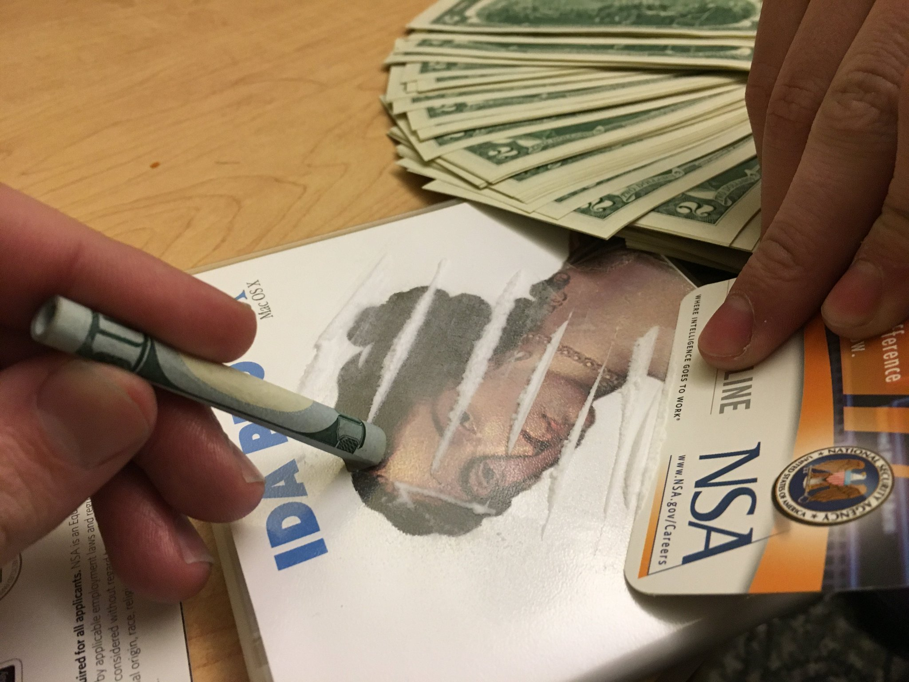

# COMP6447-Public

## Contents

🌃 SecBooks: Security related material

|_ 🎩 Black hat.

|_ 💔[Designing BSD rootkits](https://raw.githubusercontent.com/colavs19/bcit-courses/master/COMP%208045%20-%20Major%20Project/Reference%20Documents/Designing%20BSD%20Rootkits%20-%20An%20Introduction%20to%20Kernel%20Hacking.pdf) - Cooking by the book

🚀️ Wargames: Anything wargames related. Always published AFTER due date

💝 IDA.

🚪 ️Midsem.

## Friendly repos

* [**Secedu**'s exam solutions 2018](https://github.com/secedu/comp6447-exam-solutions)
* [**minight**'s exam solutions 2018](https://github.com/minight/comp6447-exam-solutions)
* [**cRAYonhear**'s 6447 work 2018](https://github.com/cRAYonhere/comp6447)
* [Basic rootkit for FreeBSD OS, written for UNSW COMP6447](https://github.com/orf53975/FreeBSDRootkit_PUBLIC)

## IDA

### Legal/Free

#### 5.0
##### [5.0 Windows](https://www.scummvm.org/news/20180331/)
> That file matches what I downloaded from the IDA website years ago. SHA256: 8f83ba2b2173bbc3158300fa9e06ac3dc23165e6db6b67f9f0aba704c719eaf4 – Carl Reinke Oct 16 '18 at 4:33
* [Mirror 1](https://github.com/Info-security/binary-auditing-training/raw/master/idafree50.exe)
* [Mirror 2](https://samsclass.info/126/proj/idafree50.exe)

#### 7.0
##### [7.0 Multi](https://www.hex-rays.com/products/ida/support/download_freeware.shtml)

OS | File
---|---
Linux  | [idafree70_linux.run](https://out7.hex-rays.com/files/idafree70_linux.run)
MAC | [idafree70_mac.tgz](https://out7.hex-rays.com/files/idafree70_mac.tgz)
Windows | [idafree70_windows.exe](https://out7.hex-rays.com/files/idafree70_windows.exe)